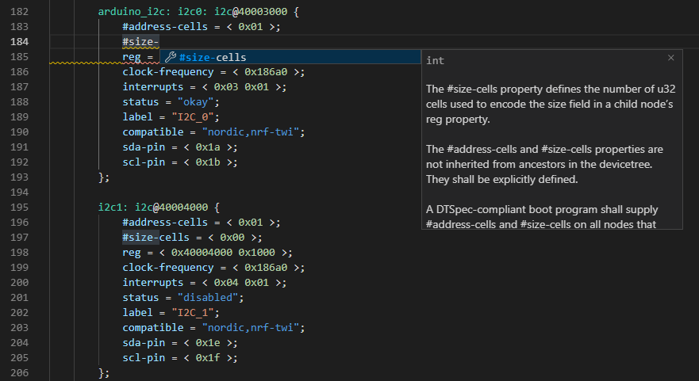
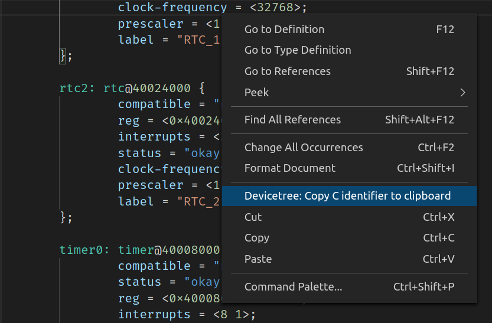
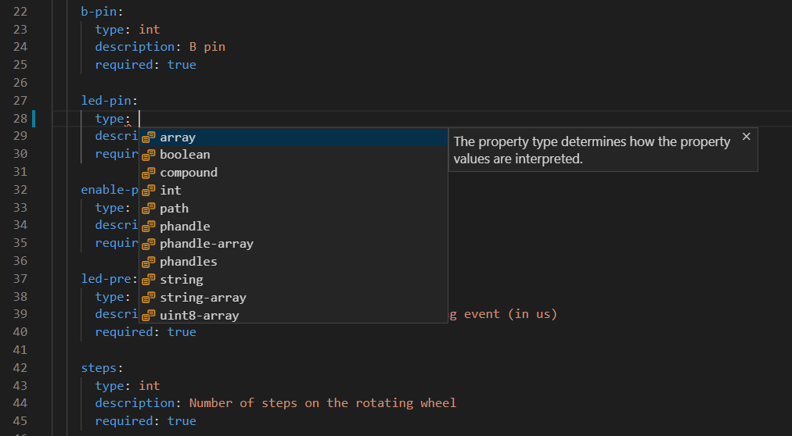

# DeviceTree for the Zephyr Project

DeviceTree language support for the [Zephyr project](https://zephyrproject.org/) in VS Code.

This extension is an independent community contribution, and is not part of the Zephyr Project.

## Features

- Syntax highlighting
- Syntax validation
- Code completion
  - Valid properties
  - Valid nodes
  - Existing child nodes
  - Node types
  - Phandle cell names
  - Preprocessor defines
- Type checking
- Hover
- Go to definition
- Go to type definition
- Show references
- Breadcrumbs navigation
- Workspace symbols
- Preview compiled DeviceTree output
- Copy C identifier to clipboard
- Show GPIO pin assignments
- Manage DeviceTree contexts
- Format selection
- Edit in overlay file menu entry
- Code completion for bindings files (depends on [Red Hat's YAML extension](https://marketplace.visualstudio.com/items?itemName=redhat.vscode-yaml))
- Code completion for certain `DT_...` macros in C
- Linting language rules
  - Redundant properties
  - Required properties
  - Reference validity
  - Phandle cell formats
  - Node specific rules
  - Bus matching
  - SPI chip select entries
  - Nexus node map validity
  - Address collisions
  - Name property matches
  - GPIO pin collisions
  - Duplicate labels
  - Nexus node map entry exists
  - Flash partitions fit inside their area
- DeviceTree overview
  - GPIO assignments
  - Flash partitions
  - Interrupts
  - Buses and their nodes
  - ADC channels
  - DAC channels
  - Clock sources

### Copy C identifiers

While selecting a node, property or value in a DeviceTree file, right click and select "DeviceTree: Copy C identifier to clipboard" to copy the matching C identifier.

If the selected symbol has a corresponding C macro, like `DT_PROP(DT_NODELABEL(adc), label)`, it will be copied to the clipboard for usage in C files. A message shows up on the status bar if there was anything to copy.

### Manage DeviceTree contexts

If you work with more than one application or board, you'll have multiple sets of DeviceTree contexts - one for each of your builds. Every time you open a new DeviceTree file, the extension will add a DeviceTree context (unless this file is already part of an existing context). Each context corresponds to a single compiled DeviceTree file that goes into a build, and consists of a board file and a list of overlay files.

The DeviceTree contexts show up in the explorer sidebar:

The DeviceTree contexts can be saved in a context file by pressing the Save button on the DeviceTree context explorer. This allows you to restore the contexts the next time you open the folder. The location of the context file can be changed by setting the "devicetree.ctxFile" configuration entry in the VS Code settings.

It's possible to add shield files to the same context by pressing "DeviceTree: Add Shield..." on the context in the DeviceTree context explorer. Shield files will be processed ahead of the overlay file.

#### DeviceTree overview

Each DeviceTree context presents an overview over common resources and their users. Each entry in the overview is linked with a specific node or property in the DeviceTree, and pressing them will go to the primary definition to the linked node or property.

 **GPIO:**

A list of all known gpio controllers, determined by the `gpio-controller` property. Each GPIO controller presents a list of the allocated pins and their owners, inferred from `gpios` properties, `-pins` properties and STM32 `pinctrl` properties.

 **Flash**

A list of all flash controllers, i.e. nodes based on the `soc-nv-flash` type binding. If the the flash controllers contain a `fixed-partitions` node, each partition will be listed with their size and address. Any unallocated space in the flash area will also be listed.

 **Interrupts**

A list of all interrupt controllers, determined by the `interrupt-controller` property. Lists the allocated interrupts on the controller and their users, as well as any other available information, such as their priority and index.

 **Buses**

A list of all known buses on the device, determined by the `bus` entry in the node's type binding. Lists important properties of the bus, such as clock speed and flow control, as well each node on the bus, as well as their address if the bus has an address space. If the bus is an SPI bus, the chip select configuration of each node is also listed if it is known.

 **ADCs**

A list of all ADC controllers on the device, i.e. nodes based on the `adc-controller` type binding. Each ADC controller contains a list of all allocated channels, based on references made to the ADC instances using the `io-channels` property.

 **DACs**

A list of all DAC controllers on the device, i.e. nodes based on the `dac-controller` type binding. Each DAC controller contains a list of all allocated channels, based on references made to the DAC instances using the `io-channels` property.

 **Clocks**

A list of all clock controllers on the device, i.e. nodes based on the `clock-controller` type binding. Each clock controller contains a list of all users of the clock, as well as any additional information, such as clock bus and flags.

### Bindings files code completion and schema validation

The DeviceTree bindings are described in yaml files. This extension provides a schema file for [Red Hat's YAML extension](https://marketplace.visualstudio.com/items?itemName=redhat.vscode-yaml), which provides code completion, documentation and validation for YAML files under dts/bindings.

## Installation

The extension can be installed from the Visual Studio Extension marketplace.

It's also possible to download specific releases from the GitHub repository by picking a devicetree-X.X.X.vsix package from the GitHub releases tab. Open Visual Studio Code and run the "Install from VSIX..." command, either through the command palette (Ctrl+Shift+P) or by opening the extensions panel, and pressing the ... menu in the top corner. Locate the VSIX package, press "Install" and reload Visual Studio Code once prompted.
